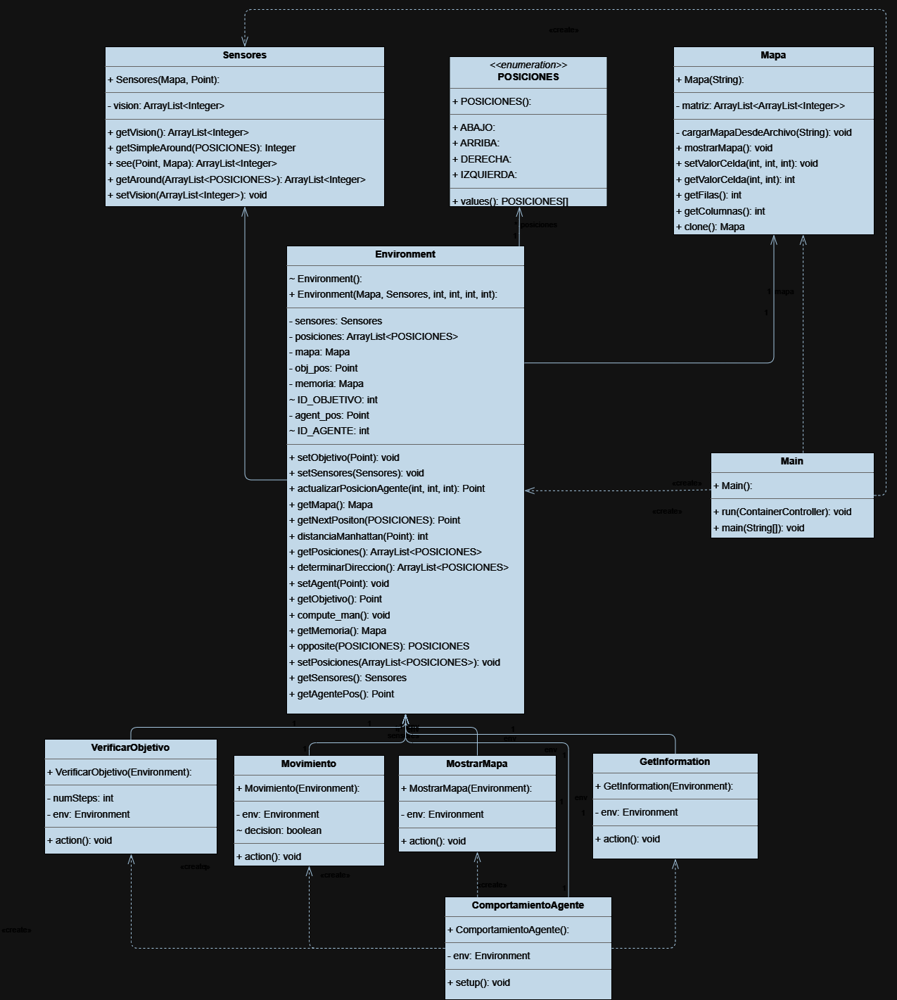
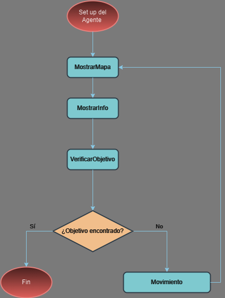

# Memoria del Diseño e Implementación del Agente en Jade

## Índice

- [Memoria del Diseño e Implementación del Agente en Jade](#memoria-del-diseño-e-implementación-del-agente-en-jade)
  - [Índice](#índice)
  - [Estructura de Clases:](#estructura-de-clases)
    - [Diagrama](#diagrama)
    - [Descripción](#descripción)
  - [Decisiones de Diseño:](#decisiones-de-diseño)
  - [Ejecución de Comportamientos:](#ejecución-de-comportamientos)
    - [Diagrama de Flujo](#diagrama-de-flujo)
  - [Problemas Resueltos:](#problemas-resueltos)
  - [Mejoras Potenciales:](#mejoras-potenciales)

## Estructura de Clases:

### Diagrama

### Descripción

1. **Clase `Mapa`:**
    - **Propósito:** Representa una matriz de valores cargada desde un archivo y proporciona métodos para acceder y modificar celdas.
    - **Uso:** Almacena la información del mapa en el entorno del agente.

2. **Clase `Sensores`:**
    - **Propósito:** Modela los sensores del agente, permitiendo la observación del entorno.
    - **Uso:** Proporciona métodos para obtener la visión actual, posiciones alrededor y direcciones asociadas a esas posiciones.

3. **Clase `Environment`:**
    - **Propósito:** Modela el entorno del agente, incluyendo el mapa, la posición del agente y el objetivo, y métodos relacionados.
    - **Uso:** Encapsula la lógica del entorno, incluyendo el cálculo de distancias, la actualización de la memoria y la determinación de direcciones.

4. **Clase `ComportamientoAgente`:**
    - **Propósito:** Define un agente con comportamientos específicos.
    - **Uso:** Configura el agente, inicializa el entorno y agrega comportamientos al agente.

5. **Clase `Movimiento`:**
    - **Propósito:** Comportamiento cíclico que implementa el movimiento del agente.
    - **Uso:** Decide el siguiente movimiento del agente, ya sea hacia el objetivo o en busca del mismo.

6. **Clase `VerificarObjetivo`:**
    - **Propósito:** Comprueba si el agente ha llegado al objetivo.
    - **Uso:** Elimina el agente una vez ha llegado al objetivo.

7. **Clase `MostrarMapa`:**
    - **Propósito:** Comportamiento cíclico para obtener la informacion del mapa.
    - **Uso:** Imprime el mapa por consola.

8. **Clase `GetInformation`:**
    - **Propósito:** Comportamiento cíclico para obtener la informacion sobre el entorno.
    - **Uso:** Imprime la informacion conocida por el agente sobre el entorno.

## Decisiones de Diseño:

1. **Mapa:**
    - Se utiliza una matriz bidimensional para representar el mapa y la memoria.
    - La memoria es el mapa conocido por el agente, este guarda la distancia Manhattan para cada posición circundante, así como las casillas recorridas.

2. **Sensores:**
    - La visión actual y las posiciones alrededor se actualizan mediante métodos específicos.

3. **Environment:**
    - La clase encapsula la lógica relacionada con el entorno del agente y se actualiza su información mediante los sensores.

4. **Comportamiento Cíclico:**
    - El comportamiento cíclico `Movimiento` decide los movimientos del agente basándose en la información del entorno.

## Ejecución de Comportamientos:

### Diagrama de Flujo

1. **Mostrar Mapa (`MostrarMapa`):**
    - Se añade a la cola de comportamientos para mostrar el estado actual del mapa y la memoria.

2. **Información (`GetInformation`):**
    - Se añade a la cola de comportamientos para obtener información sobre la posición del agente, el objetivo y la visión actual.

3. **Verificar Objetivo (`VerificarObjetivo`):**
    - Se añade a la cola de comportamientos para verificar si el agente ha alcanzado el objetivo.

4. **Calcular Mejor Movimiento (`Movimiento`):**
    - Se añade a la cola de comportamientos para calcular el próximo movimiento del agente, ya sea hacia el objetivo o en busca del mismo.

## Problemas Resueltos:

1. **Ejecución en Orden:**
    - Se ha diseñado un ciclo de comportamientos cíclicos para ejecutarse en el orden deseado (Mostrar Mapa, Información, Verificar Objetivo, Calcular Mejor Movimiento).

2. **Decisiones de Movimiento:**
    - El comportamiento `Movimiento` toma decisiones inteligentes basadas en la información de los sensores y la memoria.

3. **Actualización de la Memoria:**
    - La memoria se actualiza correctamente, considerando la distancia de Manhattan y evitando celdas ya visitadas.

## Mejoras Potenciales:

1. **Optimización de Cálculos:**
    - Se podrían realizar optimizaciones en los cálculos de distancia de Manhattan o la determinación de direcciones.

2. **Interfaz de Usuario:**
    - Se podría considerar agregar una interfaz de usuario gráfica para una representación visual del entorno y los movimientos del agente.

3. **Manejo de Objetivos Múltiples:**
    - Si se desea, se podrían realizar modificaciones para manejar la búsqueda de múltiples objetivos.
